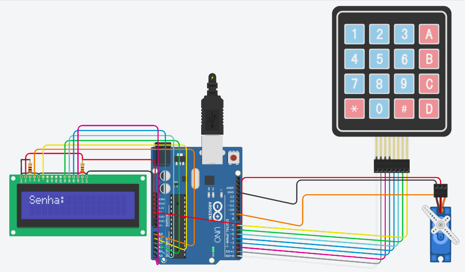
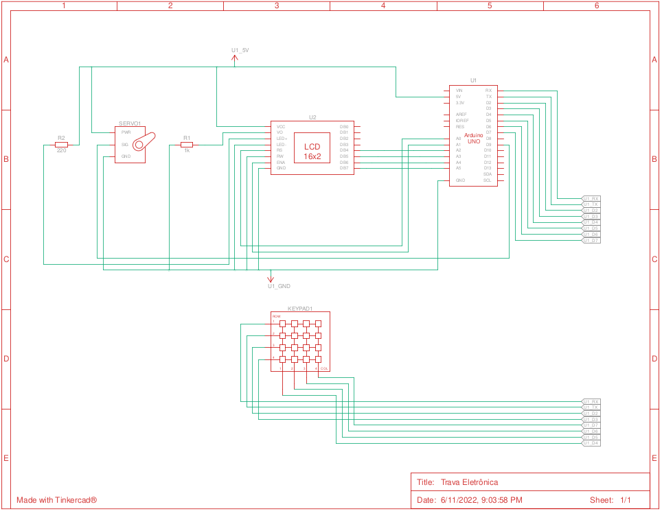

# IOT-Development
Trabalho final da disciplina de IOT Development pela FIAP.

## Integrantes do grupo
### `Giovana Rocha Santos` `Jackson Roque` `Michael dos Santos Silva`

## Tema do Trabalho: Trava Eletrônica

Este sistema tem por finalidade demonstrar uma trava eletrônica de uma porta. Onde é digitado uma senha para que a trava seja acionada e porta seja aberta.

O sistema tem uma inteligência que após a porta esteja aberta, ele espera alguns segundos e fecha a porta novamente de forma automática.

## Link do projeto no Tinkercad <a href="https://www.tinkercad.com/things/gyCDJCO2706?sharecode=VhlBTLhMDpbyTJzEG7gAZHjORP67gvdvIOPeP0emjNA">Trava Eletrônica</a>

## Componentes utilizados

    
1 Arduino Uno R3

    
1 Keypad 4x4

    
1 LCD 16x2

    
1 Micro Servo

    
1 Resistor 1kΩ

    
1 Resistor 220Ω

## Circuito
